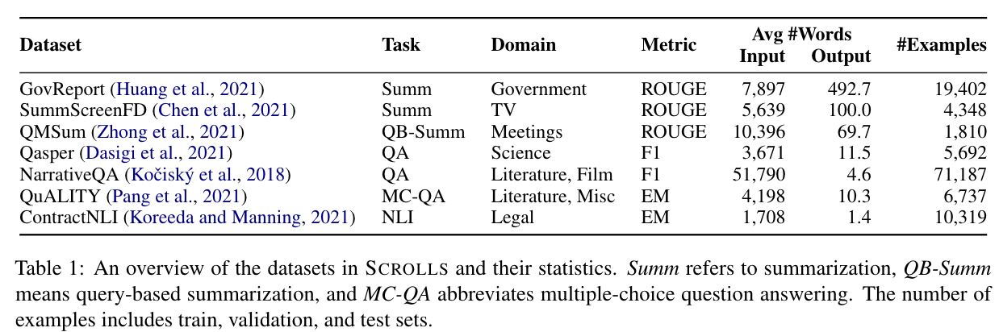

# SCROLLS benchmark

> SCROLLS is a suite of datasets that require synthesizing information over long texts. The benchmark includes seven natural language tasks across multiple domains, including summarization, question answering, and natural language inference.

data: https://huggingface.co/datasets/tau/scrolls, https://www.scrolls-benchmark.com/tasks

paper: https://arxiv.org/abs/2201.03533

repository: https://github.com/tau-nlp/scrolls

leaderboard: https://www.scrolls-benchmark.com/leaderboard

[SLED paper](https://arxiv.org/abs/2208.00748) has additionally used SQuAD and HotPotQA (with two gold paragraphs): https://huggingface.co/datasets/tau/sled to benchmark long-text models.



This dataset is formatted in text-to-text format and is well suited for encoder-decoder and decoder-only models. Encoder-only models could be benchmarked on ContractNLI text classification task and multiple-choice QA on QuALITY.

## Fine-tuning
### ContractNLI
example scripts with grid search: `finetune_contract_nli_encoder.sh` & `finetune_contract_nli.sh`:
```bash
CUDA_VISIBLE_DEVICES=0,1 NP=2 ./finetune_contract_nli.sh
```

Results and the best performing hyperparameters (3 runs per set of hparams):
| model           | input_seq_len | EM (valid)    | bs  | lr    | optimizer | scheduler | wd    | steps | patience |
| --------------- | ------------- | ------------- | --- | ----- | --------- | --------- | ----- | ----- | -------- |
| bert-base-cased | 256           | 70.42 +- 0.44 | 32  | 2e-05 | AdamW     | linear    | 1e-03 | 9000  | 15       |
| bert-base-cased | 512           | 71.93 +- 0.40 | 32  | 5e-05 | AdamW     | linear    | 1e-03 | 9000  | 15       |
| roberta-base    | 256           | 71.74 +- 0.40 | 32  | 2e-05 | AdamW     | constant  | 1e-03 | 9000  | 15       |
| roberta-base    | 512           | 74.41 +- 0.39 | 32  | 2e-05 | AdamW     | constant  | 1e-03 | 9000  | 15       |
| deberta-v3-base | 256           | 71.55 +- 0.48 | 32  | 2e-05 | AdamW     | linear    | 1e-03 | 9000  | 15       |
| deberta-v3-base | 512           | 74.57 +- 0.42 | 32  | 2e-05 | AdamW     | constant  | 1e-03 | 9000  | 15       |
| bart-base       | 256           | 71.48 +- 0.79 | 32  | 2e-04 | AdamW     | linear    | 1e-03 | 9000  | 15       |
| bart-base       | 512           | 74.31 +- 0.22 | 32  | 2e-05 | AdamW     | constant  | 1e-03 | 9000  | 15       |
| bart-base       | 1024          | 77.23 +- 0.40 | 32  | 1e-04 | AdamW     | linear    | 1e-03 | 9000  | 15       |
| t5-base         | 256           | 72.16 +-0.19  | 32  | 2e-04 | AdamW     | linear    | 1e-03 | 9000  | 15       |
| t5-base         | 512           | 74.37 +- 0.48 | 32  | 3e-04 | AdamW     | linear    | 1e-03 | 9000  | 15       |
| t5-base         | 1024          | 79.58 +- 0.19 | 32  | 5e-05 | AdamW     | constant  | 1e-03 | 9000  | 15       |

`constant` lr scheduler is `constant_with_warmup` from [HF](https://huggingface.co/docs/transformers/main_classes/optimizer_schedules#schedules). The full set of hyperparameters could be found in `./finetune_contract_nli_encoder.sh` and `run_finetuning_scrolls.py`.

### QuALITY
script:
```bash
CUDA_VISIBLE_DEVICES=0,1 NP=2 ./finetune_quality.sh
```

Results and the best performing hyperparameters (3 runs per set of hparams):

| model              | input_seq_len | EM (valid)    | bs  | lr    | optimizer | scheduler | wd    | steps | patience |
| ------------------ | ------------- | ------------- | --- | ----- | --------- | --------- | ----- | ----- | -------- |
| facebook/bart-base | 256           | 32.90 +- 0.39 | 32  | 5e-05 | AdamW     | linear    | 1e-03 | 6400  | 10       |
| facebook/bart-base | 512           | 32.95 +- 0.53 | 32  | 1e-04 | AdamW     | linear    | 1e-03 | 6400  | 10       |
| facebook/bart-base | 1024          | 32.63 +- 0.63 | 32  | 2e-05 | AdamW     | linear    | 1e-03 | 6400  | 10       |
| t5-base            | 256           | 33.45 +- 0.51 | 32  | 3e-04 | AdamW     | linear    | 1e-03 | 6400  | 10       |
| t5-base            | 512           | 33.54 +- 0.26 | 32  | 5e-05 | AdamW     | constant  | 1e-03 | 6400  | 10       |
| t5-base            | 1024          | 33.68 +- 0.67 | 32  | 2e-04 | AdamW     | linear    | 1e-03 | 6400  | 10       |

Check `./finetune_quality.sh` and `run_finetuning_scrolls.py` for other training details.


### Qasper
script: `finetune_qasper.sh`


> TODO: report the best set of params and scores

> TODO: add qmsum, narrative_qa, summ_screen_fd, gov_report

## How to generate test set predictions
TBD
